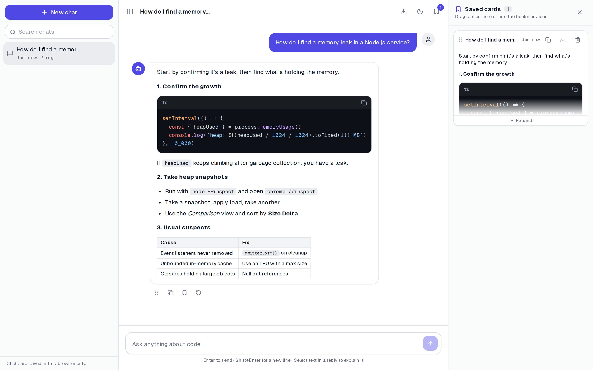
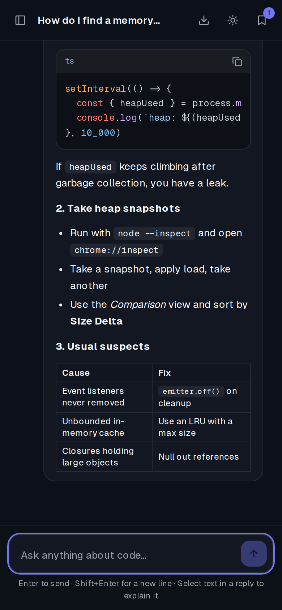

# DevAssist: a streaming AI coding assistant

A chat assistant for developers, built with **Next.js 14 (App Router)**, **TypeScript** and **Groq**. Replies stream in token by token. You can stop a reply partway, save useful answers as cards, and select any text in a reply to get a quick explanation.



| Explain any selection | Dark mode on mobile |
| --- | --- |
|  |  |

## Features

- **Streaming responses.** Tokens show up as the model generates them. You can **Stop** a reply partway and **Regenerate** the last one.
- **Conversation history.** Each chat gets a title automatically. You can search, rename and delete chats, and they're saved in the browser (localStorage).
- **Saved cards.** Keep good answers by dragging a reply into the panel or clicking the bookmark icon. Cards can be reordered, copied and downloaded as `.md`.
- **Explain selection.** Select text in a reply to stream a short explanation in a popover. You can then continue in the main chat.
- **Rich markdown.** Replies render GFM tables and lists, and code gets syntax highlighting, a language label and a copy button.
- **Export** any conversation as Markdown.
- **Dark mode** that follows the system setting, with no flash on load. The layout is **responsive** and works down to phone width.

## Tech stack

Next.js 14 · React 18 · TypeScript (strict) · Tailwind CSS · Groq SDK (`openai/gpt-oss-20b`) · zod · react-markdown + highlight.js · Vercel

## How streaming works

```mermaid
sequenceDiagram
    participant UI as Browser (useChat)
    participant API as /api/chat (Next.js route)
    participant G as Groq API
    UI->>API: POST { mode, messages }
    API->>API: zod validation + rate limit
    API->>G: chat.completions.create({ stream: true })
    loop each chunk
        G-->>API: delta.content
        API-->>UI: text/plain chunk
        UI->>UI: dispatch message/append
    end
    Note over UI,G: Stop button → fetch abort → stream cancel() → upstream abort
```



## Architecture

```
ai-chat-assistant/src/
├── app/
│   ├── api/chat/route.ts     # Validate → rate-limit → stream Groq tokens as text/plain
│   ├── layout.tsx            # Self-hosted fonts, theme bootstrap script
│   └── page.tsx              # App shell: sidebar · chat · cards
├── components/
│   ├── chat/                 # ChatPanel, MessageItem, Composer, ExplainPopover
│   ├── cards/CardsPanel.tsx
│   ├── Sidebar.tsx
│   └── ui/                   # Markdown, CopyButton, ThemeToggle
├── hooks/
│   ├── useChat.ts            # send / stop / regenerate lifecycle
│   └── useAutoScroll.ts      # stick to bottom unless the user scrolls up
├── store/
│   ├── chat-reducer.ts       # Pure reducer: every state transition in one place
│   └── ChatStore.tsx         # Context provider + debounced localStorage persistence
└── lib/
    ├── schema.ts             # zod request schema (shared limits)
    ├── stream-client.ts      # fetch + ReadableStream reader
    ├── server/               # server-only: Groq client, prompts, rate limiter
    ├── types.ts
    └── utils.ts
```

### Design decisions

| Decision | Why |
| --- | --- |
| **Plain-text stream** instead of SSE or a chat SDK | The client only needs tokens, so reading `response.body` needs no parsing library. `TextDecoder({ stream: true })` keeps multi-byte characters intact across chunk boundaries. |
| **Cancellation end-to-end** | The Stop button aborts the `fetch`. That triggers the route's `ReadableStream.cancel()`, which aborts the upstream Groq request, so you don't pay for tokens nobody reads. |
| **Server owns the system prompts** | The client can only send `user` and `assistant` roles (enforced by zod), so it can't inject its own system prompt. The `mode` field picks between prompts defined on the server. |
| **Pure reducer for state** | All transitions (append token, finish, truncate for regenerate, reorder cards) are pure functions that are easy to unit test and reason about. |
| **Debounced persistence** | Streaming can dispatch dozens of updates per second. localStorage is written at most every 400 ms. |
| **Model set by an env var** | Groq retired `llama-3.1-8b-instant` in August 2026. With `GROQ_MODEL`, the next deprecation is a config change, not a code change. |
| **Error mapping** | Upstream 401, 404, 429 and 5xx errors become clear, typed messages. API keys and stack traces never reach the client. |
| **In-memory rate limiter** | 20 requests per minute per IP. On serverless each instance keeps its own count, so this is best-effort. Swap in Redis or Upstash behind the same function for a hard limit. |

## Getting started

```bash
cd ai-chat-assistant
npm install
cp .env.example .env.local   # add your GROQ_API_KEY
npm run dev
```

Open http://localhost:3000.

| Variable | Required | Default |
| --- | --- | --- |
| `GROQ_API_KEY` | yes (get one at [console.groq.com/keys](https://console.groq.com/keys)) | none |
| `GROQ_MODEL` | no | `openai/gpt-oss-20b` |

## API

`POST /api/chat`

```json
{ "mode": "chat", "messages": [{ "role": "user", "content": "Explain closures" }] }
```

Success returns a `text/plain` stream of the reply. Errors return JSON: `{ "error": string, "type": "bad_request" | "rate_limit" | "config_error" | "model_not_found" | "upstream_error" }`.

`GET /api/chat` is a health check. It reports the configured model and whether the key is set, without spending tokens.

## Deploying to Vercel

1. Import the repo on Vercel and set **Root Directory** to `ai-chat-assistant`.
2. Add `GROQ_API_KEY` (and optionally `GROQ_MODEL`) under Project → Settings → Environment Variables.
3. Deploy.

## Roadmap

- Store conversations in a database behind authentication, so they sync across devices
- Unit tests for `chat-reducer.ts` and the route's error mapping
- A shared, Redis-backed rate limiter
